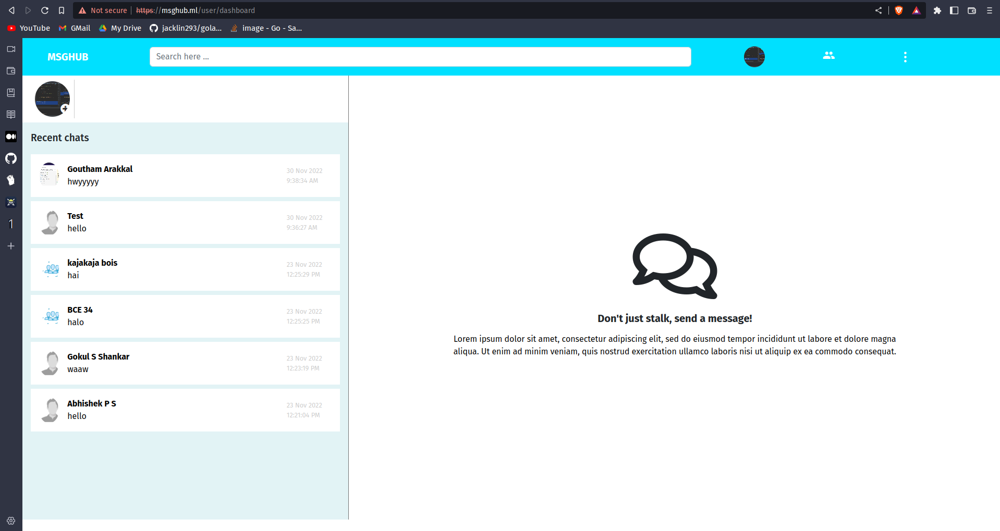
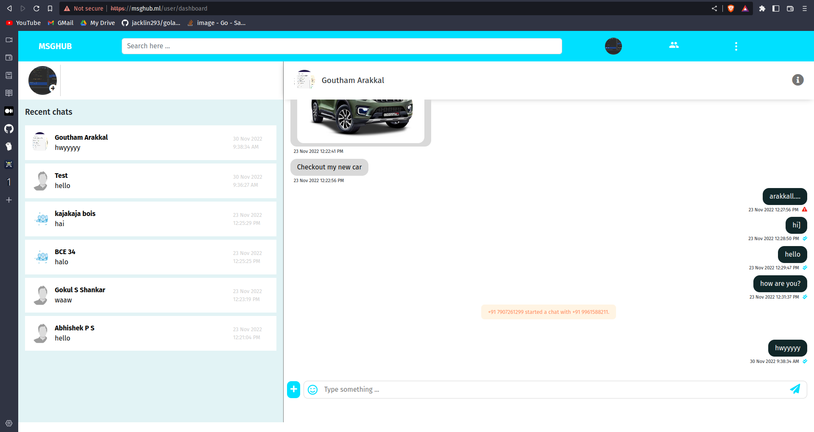
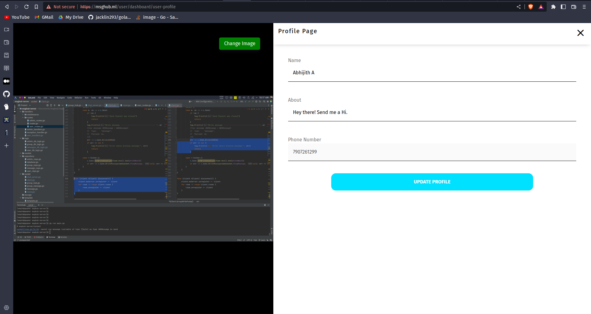
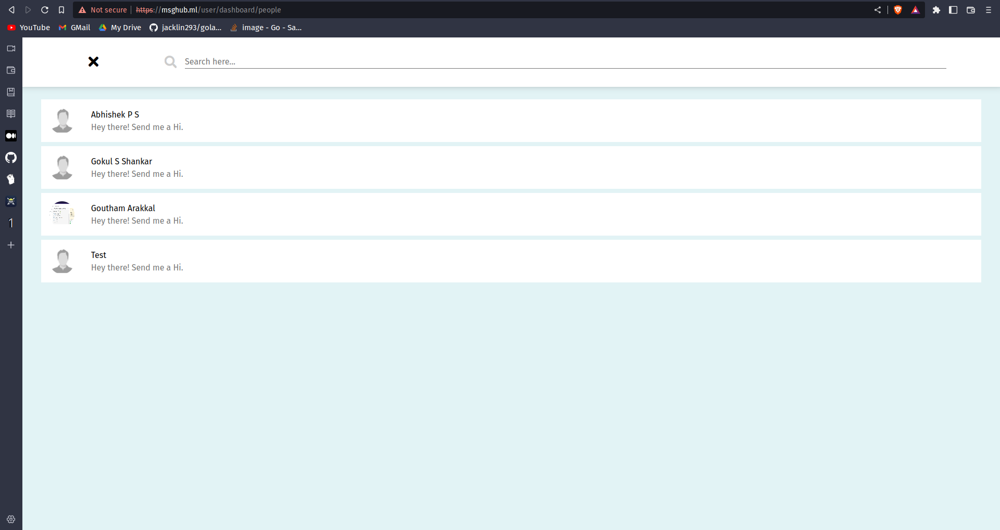

## MSGHUB - CHAT APPLICATION
<div style="display: flex;"> 
  &nbsp;&nbsp;&nbsp;
  &nbsp;&nbsp;&nbsp;
  
</div>
A messaging application built using <strong>golang</strong> and<strong> bootstrap</strong>, one can group message and personal message.<br>
The front-end section of the application consist of HTML, CSS, JS & Bootstrap and the backend is completely built on Golang (GO). And to access websocket the developer has used the help of gorilla/websocket.<br><br>

> Any UI based contributions are highly encouraged.

## Features 
- Personal Messaging
- Group Messaging
- Story / Status viewing and adding
- Group Creation
<br>

> The app do have limitations because the front-end is just html, css and js.
> Therefore Live reload may not be possible like react or other front-end frameworks.

## Screenshots
<br><br>
<br><br>
<br><br>
<br><br>

## 💻 Test application on your machine
- Create ```.env``` file in the ```msghub-server``` directory which should include -
  - TWILIO_SID
  - TWILIO_TOKEN
  - TWILIO_SERVICE
  - DB_HOST
  - DB_PORT
  - DB_USER
  - DB_PASS
  - DB_NAME
  - DB_SSLMODE
  - AWS_S3_REGION
  - AWS_S3_BUCKET
  - JWT_KEY
- Then open terminal from root directory of this application and run :
```
cd msghub-server
```
```
go mod tidy
```
```
go run main.go
```
- Then open ```http://localhost:9000/``` in your browser.

> The websocket might not work when you running this application locally because websocket runs on <strong>wss</strong> protocol.

## ❤ Conclusion
🌟 Star this repo & follow for more 😊

<a href="https://www.buymeacoffee.com/abgth" target="_blank"></a>